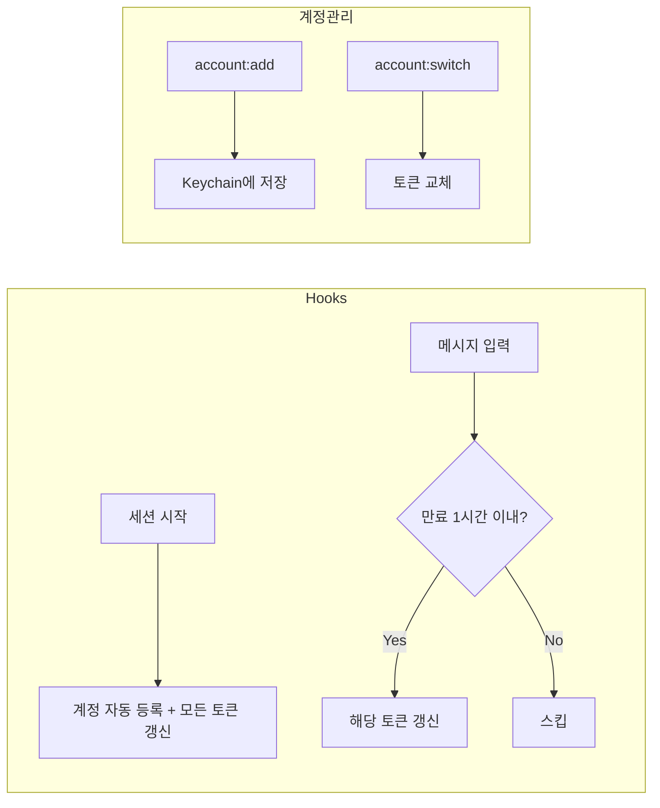

# Claude Code Multi-Account Manager

[English](README.md)

Claude Code 다중 계정 관리 플러그인. 여러 계정을 **로그아웃 없이** 전환하고, 사용량을 한눈에 모니터링합니다.

## 설치

```bash
# 마켓플레이스 등록 (최초 1회)
claude plugin marketplace add https://github.com/lee-ji-hoon/claude-multi-account-manager.git

# 플러그인 설치
claude plugin install account@lee-ji-hoon

# Claude Code 재시작
```

설치 후 세션을 시작하면 현재 계정이 자동으로 등록되고, 터미널 alias(`account`, `account-list`, `account-switch`)가 설정됩니다.

## 주요 기능

- **계정 전환** — 로그아웃 없이 저장된 계정으로 즉시 전환
- **자동 토큰 갱신** — 세션 시작 시 모든 계정, 메시지 입력 시 만료 임박 토큰 갱신
- **사용량 모니터링** — 현재 세션(5h) / 주간(7d) 사용량 프로그레스 바
- **Plan 자동 감지** — Free / Pro / Team / Max5 / Max20
- **Organization 지원** — 같은 이메일이라도 개인/조직 계정 별도 관리

## 명령어

| 명령어 | 설명 |
|--------|------|
| `/account:list` | 계정 목록 + 실시간 사용량 |
| `/account:add [이름]` | 현재 계정 저장 |
| `/account:switch [id]` | 계정 전환 |
| `/account:remove [id]` | 계정 삭제 |
| `/account:check` | 토큰 상태 확인 |
| `/account:set-plan [id] [plan]` | Plan 수동 설정 |
| `/account:export` | 계정 정보 JSON 추출 |
| `/account:import [json]` | 다른 PC에서 계정 가져오기 |
| `/account:logs` | 토큰 갱신 로그 확인 |
| `/account:repair` | 설치 문제 진단 및 수리 |
| `/account:report` | 버그 리포트 GitHub Issue 자동 생성 |

## 사용 예시

```
/account:list

  Claude 계정 목록
  ───────────────────────────────────────────────────────
  [1] ● work @Team [Max5] - 활성
      work@company.com
      현재 ██░░░░░░░░░░ 24% | ⏱ 4h 27m
      주간 ██████░░░░░░ 51% | ⏱ 87h 27m
      토큰 🔑 6h 15m 후 만료

  [2]   personal [Pro]
      me@gmail.com
      주간 ███░░░░░░░░░ 30% | ⏱ 120h 10m
      토큰 🔑 3h 42m 후 만료
  ───────────────────────────────────────────────────────
```

## 동작 원리



### 데이터 저장 위치

| 항목 | 위치 |
|------|------|
| 계정 목록 | `~/.claude/accounts/index.json` |
| OAuth 토큰 | macOS Keychain + `~/.claude/accounts/credential_*.json` |
| 프로필 | `~/.claude/accounts/profile_*.json` |
| 갱신 로그 | `~/.claude/accounts/logs/token-refresh.log` |

## 터미널 사용

설치 후 터미널에서도 직접 사용할 수 있습니다:

```bash
account              # 도움말
account list         # 계정 목록
account switch       # 대화형 전환
account-list         # 단축 alias
account-switch       # 단축 alias
```

## 다중 PC 동기화 (선택)

Telegram Bot을 통해 여러 Mac 간 계정 데이터를 동기화할 수 있습니다.

```bash
# Mac A에서 전송
/account:push

# Mac B에서 수신
/account:pull
```

설정: `~/.claude/hooks/telegram-config.json`에 `bot_token`, `chat_id` 추가 필요.

## 문제 해결

### `/account:repair` — 자동 진단

설치 문제, 토큰 오류, 중복 계정 등을 자동으로 진단하고 수리합니다.

### `/account:report` — 버그 리포트

문제가 해결되지 않으면 `/account:report`로 진단 정보를 수집하여 GitHub Issue를 자동 생성할 수 있습니다.

### 수동 확인

```bash
# 토큰 상태
/account:check

# 갱신 로그 확인
/account:logs

# 로그 파일 직접 확인
cat ~/.claude/accounts/logs/token-refresh.log
```

## 요구사항

- macOS (Keychain 사용)
- Python 3.8+
- Claude Code CLI

## 기여

버그 리포트나 기능 제안은 [Issues](https://github.com/lee-ji-hoon/claude-multi-account-manager/issues)에 등록해주세요.
Claude Code 세션에서 `/account:report`를 실행하면 진단 정보가 포함된 Issue가 자동 생성됩니다.

## 라이선스

MIT
