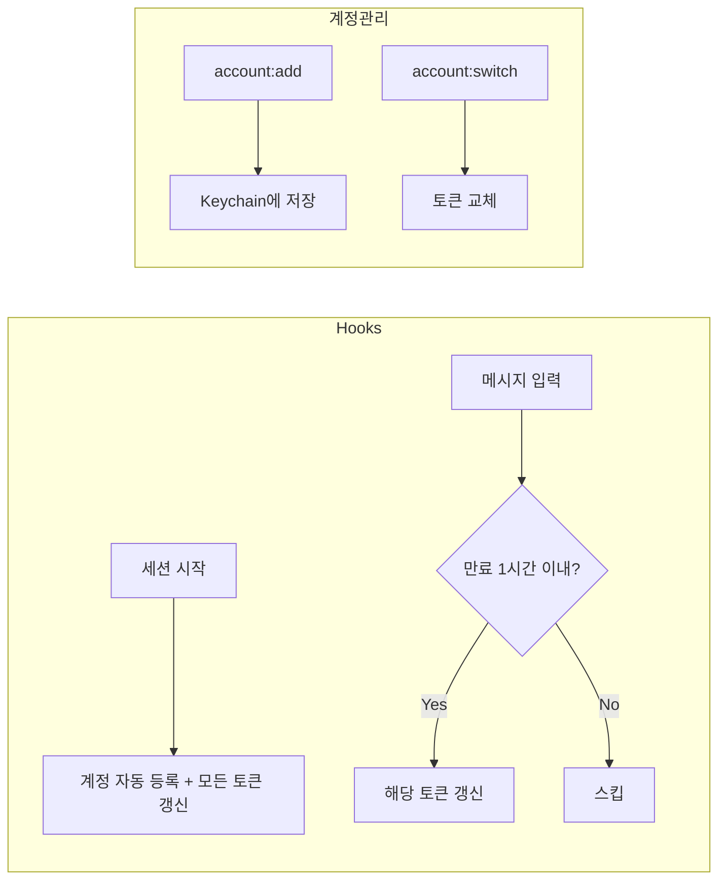

# Switchboard — AI Account Switcher

[English](README.md)

AI 코딩 CLI 계정을 한곳에서 모니터링하고 전환합니다. 현재 CLI 플러그인은 Claude Code와 Codex를 지원하며, 네이티브 macOS 메뉴바 프로토타입은 Claude·Codex·Grok·Antigravity(`agy`) 기반 Gemini 실사용량을 읽습니다.

## macOS 메뉴바 앱


Claude/Codex usage API, Grok 로컬 `/usage`, Antigravity의 읽기 전용
`/usage`·`/credits` JSON을 읽습니다. `LIVE`와 보강용 `DEMO`를 구분하며,
사용량·초기화 시각·Codex 리셋 크레딧·AGY 크레딧을 표시하고 남은 한도에
따라 계정을 추천합니다.

| 공급자 | 상태 읽기 | 앱 동작 |
|---|---|---|
| Claude | 5시간/주간 사용량, 초기화, 토큰 상태 | 저장 계정 전환 후 프로필·Keychain·계정 ID readback 확인 |
| Codex | 5시간/주간 사용량, 초기화, 리셋/추가 크레딧 | 저장 계정 전환 후 `auth.json` account ID readback 확인 |
| Grok | 주간 사용량과 초기화 | 기존 세션은 유지하고 선택한 `GROK_HOME` 프로필로 새 세션 실행 |
| Antigravity (`agy`) | Gemini 모델 quota와 크레딧 | 공식 계정 전환 명령이 없어 CLI 재인증 안내만 제공 |

Grok 웹의 “사용 한도 재설정” 횟수·만료일은 안정된 로컬 API가 없으므로
앱에서 값을 추측하지 않습니다. 대신 웹 Usage 화면을 여는 링크를 제공하고,
재설정 적용·크레딧 구매·자동 충전은 실행하지 않습니다.

### 앱 설치

릴리스의 `Switchboard-macos.zip`을 풀어 `Switchboard.app`을
`~/Applications`에 놓거나, 저장소에서 직접 빌드해 설치합니다.

```bash
git clone https://github.com/lee-ji-hoon/ai-account-switcher.git
cd ai-account-switcher
prototype/switchboard-menubar/install.sh
open "$HOME/Applications/Switchboard.app"
```

앱의 LIVE 조회·전환에는 Python 3.8 이상이 필요합니다(Homebrew Python 또는
Xcode Command Line Tools의 `python3`). 로컬 빌드는 Xcode Command Line Tools와
macOS 14 이상이 필요합니다. GitHub 릴리스 앱은 ad-hoc 서명이라 macOS가 차단하면 Finder에서 앱을 Control-클릭한
뒤 **열기**를 선택하거나 위 로컬 빌드 설치를 사용하세요.

Grok 계정을 여러 개 쓰려면 인증 파일을 복사하지 말고 프로필마다 한 번씩
공식 로그인을 진행합니다.

```bash
mkdir -p "$HOME/.grok-profiles/personal"
GROK_HOME="$HOME/.grok-profiles/personal" grok login --oauth

mkdir -p "$HOME/.grok-profiles/work"
GROK_HOME="$HOME/.grok-profiles/work" grok login --oauth
```

Switchboard는 `~/.grok`과 `~/.grok-profiles/*`의 로그인된 프로필만 표시하며,
`auth.json`을 복사하거나 서로 교체하지 않습니다.

## Claude 플러그인 설치

```bash
# 마켓플레이스 등록 (최초 1회)
claude plugin marketplace add https://github.com/lee-ji-hoon/ai-account-switcher.git

# 플러그인 설치
claude plugin install account@lee-ji-hoon

# Claude Code 재시작
```

설치 후 세션을 시작하면 현재 계정이 자동으로 등록되고, 터미널 alias(`account`, `account-list`, `account-switch`)가 설정됩니다.

## 주요 기능

- **계정 전환** — 로그아웃 없이 저장된 계정으로 즉시 전환
- **자동 토큰 갱신** — 세션 시작 시 모든 계정, 메시지 입력 시 만료 임박 토큰 갱신
- **사용량 모니터링** — 현재 세션(5h) / 주간(7d) 사용량 프로그레스 바
- **Plan 자동 감지** — Free / Pro / Team / Max5 / Max20
- **Organization 지원** — 같은 이메일이라도 개인/조직 계정 별도 관리

## 명령어

| 명령어 | 설명 |
|--------|------|
| `/account:list` | 계정 목록 + 실시간 사용량 |
| `/account:add [이름]` | 현재 계정 저장 |
| `/account:switch [id]` | 계정 전환 |
| `/account:remove [id]` | 계정 삭제 |
| `/account:check` | 토큰 상태 확인 |
| `/account:set-plan [id] [plan]` | Plan 수동 설정 |
| `/account:export` | 계정 정보 JSON 추출 |
| `/account:import [json]` | 다른 PC에서 계정 가져오기 |
| `/account:logs` | 토큰 갱신 로그 확인 |
| `/account:repair` | 설치 문제 진단 및 수리 |
| `/account:report` | 버그 리포트 GitHub Issue 자동 생성 |

## 사용 예시

```
/account:list

  Claude 계정 목록
  ───────────────────────────────────────────────────────
  [1] ● work @Team [Max5] - 활성
      work@company.com
      현재 ██░░░░░░░░░░ 24% | ⏱ 4h 27m
      주간 ██████░░░░░░ 51% | ⏱ 87h 27m
      토큰 🔑 6h 15m 후 만료

  [2]   personal [Pro]
      me@gmail.com
      주간 ███░░░░░░░░░ 30% | ⏱ 120h 10m
      토큰 🔑 3h 42m 후 만료
  ───────────────────────────────────────────────────────
```

## 동작 원리


```mermaid
flowchart LR
    subgraph Hooks
        A[세션 시작] --> B[계정 자동 등록 + 모든 토큰 갱신]
        C[메시지 입력] --> D{만료 1시간 이내?}
        D -->|Yes| E[해당 토큰 갱신]
        D -->|No| F[스킵]
    end

    subgraph 계정관리
        G["account:add"] --> H[Keychain에 저장]
        I["account:switch"] --> J[토큰 교체]
    end
```

### 데이터 저장 위치

| 항목 | 위치 |
|------|------|
| 계정 목록 | `~/.claude/accounts/index.json` |
| OAuth 토큰 | macOS Keychain + `~/.claude/accounts/credential_*.json` |
| 프로필 | `~/.claude/accounts/profile_*.json` |
| 갱신 로그 | `~/.claude/accounts/logs/token-refresh.log` |

## 터미널 사용

설치 후 터미널에서도 직접 사용할 수 있습니다:

```bash
account              # 도움말
account list         # 계정 목록
account switch       # 대화형 전환
account-list         # 단축 alias
account-switch       # 단축 alias
```

## 다중 PC 동기화 (선택)

Telegram Bot을 통해 여러 Mac 간 계정 데이터를 동기화할 수 있습니다.

```bash
# Mac A에서 전송
/account:push

# Mac B에서 수신
/account:pull
```

설정: `~/.claude/hooks/telegram-config.json`에 `bot_token`, `chat_id` 추가 필요.

## 문제 해결

### `/account:repair` — 자동 진단

설치 문제, 토큰 오류, 중복 계정 등을 자동으로 진단하고 수리합니다.

### `/account:report` — 버그 리포트

문제가 해결되지 않으면 `/account:report`로 진단 정보를 수집하여 GitHub Issue를 자동 생성할 수 있습니다.

### 수동 확인

```bash
# 토큰 상태
/account:check

# 갱신 로그 확인
/account:logs

# 로그 파일 직접 확인
cat ~/.claude/accounts/logs/token-refresh.log
```

## 요구사항

- macOS (Keychain 사용)
- Python 3.8+
- Claude Code CLI

## 기여

버그 리포트나 기능 제안은 [Issues](https://github.com/lee-ji-hoon/ai-account-switcher/issues)에 등록해주세요.
Claude Code 세션에서 `/account:report`를 실행하면 진단 정보가 포함된 Issue가 자동 생성됩니다.

## 라이선스

MIT
