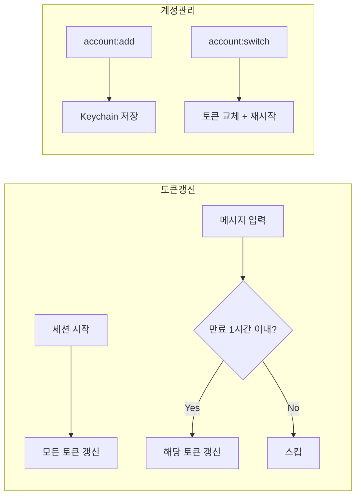

# Claude Code Multi-Account Manager

Claude Code 다중 계정 관리 플러그인. 여러 계정을 로그아웃 없이 전환하고 관리합니다.

## 설치

```bash
# 마켓플레이스 등록 (최초 1회)
claude plugin marketplace add https://github.com/lee-ji-hoon/claude-multi-account-manager.git

# 플러그인 설치
claude plugin install account@lee-ji-hoon

# Claude Code 재시작
```

Claude 세션 내에서 위 명령어 실행을 요청하거나, 터미널에서 직접 실행하세요.

## 동작 원리



## 명령어

| 명령어 | 설명 |
|--------|------|
| `/account:list` | 계정 목록 + 사용량 |
| `/account:add [이름]` | 현재 계정 저장 |
| `/account:switch [id]` | 계정 전환 |
| `/account:check` | 토큰 상태 확인 |
| `/account:remove <id>` | 계정 삭제 |
| `/account:set-plan <id> <plan>` | Plan 설정 |
| `/account:push` | 계정 데이터를 텔레그램으로 전송 (다른 맥 동기화) |
| `/account:pull` | 텔레그램에서 계정 데이터 가져오기 |

## 예시

```
/account:list

  Claude 계정 목록
  ───────────────────────────────────────────────────────
  [1] → work [Max5] - 현재
      work@company.com
      현재 ██░░░░░░░░░░ 24% | ⏱ 4h 27m
      주간 ██████░░░░░░ 51% | ⏱ 87h 27m

  [2] ○ personal [Pro] - 저장됨
      me@gmail.com
  ───────────────────────────────────────────────────────
```

## 터미널 런처

Claude Code를 시작하기 전에 계정/세션을 선택할 수 있는 런처:

```bash
cl                 # 대화형 런처
cl -c              # 바로 continue (이전 대화)
```

```
  Claude Code Launcher
  ==================================================
  현재: work@company.com @Team [Max5]
  사용량: ██████░░░░ 45%

  실행 중인 세션:
    • tmux/soop (3 windows)

  등록된 계정:
  [1] ● work @Team [Max5] work@company.com
  [2]   personal [Pro] me@gmail.com

  [Enter] 새 세션 / [c] continue / [r] resume / [s] 계정 전환
```

## 다중 맥 동기화 (Telegram)

텔레그램을 통해 여러 맥 간 계정 데이터를 동기화합니다.

```bash
# Mac A에서
/account:push          # → 텔레그램으로 전송

# Mac B에서
/account:pull          # ← 텔레그램에서 가져오기
```

필요 설정: `~/.claude/hooks/telegram-config.json` (bot_token, chat_id)

## 주요 기능

- **자동 토큰 갱신**
  - 세션 시작 시: 모든 계정 토큰 갱신
  - 메시지 입력 시: 만료 임박(1시간 이내) 토큰 갱신
- **사용량 모니터링** - 현재 세션 / 주간 사용량 시각화
- **Plan 자동 감지** - Free / Pro / Team / Max5 / Max20
- **다중 맥 동기화** - 텔레그램 기반 push/pull
- **대화형 런처** - 계정 선택 + 세션 관리

## Obsidian 대시보드

Google Drive Obsidian 볼트에 Claude Code 상태를 5분마다 자동 기록합니다.

표시 내용: 계정 목록, 사용량(5h/7d), 토큰 만료 시간, tmux 세션, 프로세스 수, 통계

```bash
# 수동 실행
python3 bin/claude-dashboard

# launchd 설치 (5분 주기 자동 갱신)
cp bin/com.claude-dashboard.plist ~/Library/LaunchAgents/
launchctl load ~/Library/LaunchAgents/com.claude-dashboard.plist

# 로그 확인
tail -f /tmp/claude-dashboard.log
```

## ttyd 웹 터미널

tmux 세션을 브라우저에서 read-only로 확인할 수 있습니다.

```bash
# 설치 + launchd 등록
./bin/setup-ttyd.sh

# 또는 수동
brew install ttyd
ttyd -R -p 7681 tmux attach -t tg-bridge
```

Tailscale과 함께 사용하면 폰에서도 `http://<tailscale-ip>:7681`로 접근 가능합니다.

## 요구사항

- macOS (Keychain 사용)
- Python 3.8+
- Claude Code CLI

## 라이선스

MIT
