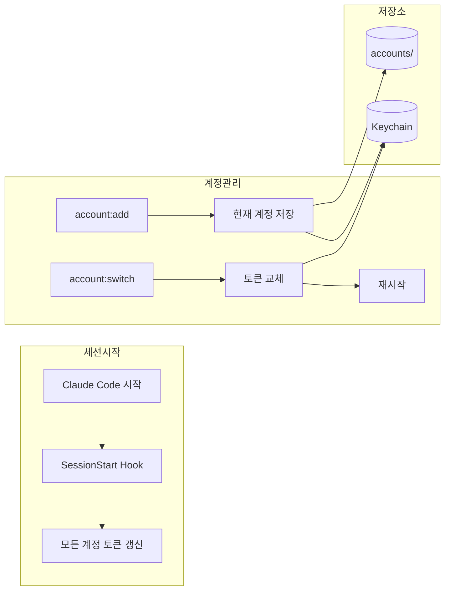

# Claude Code Multi-Account Manager

Claude Code 다중 계정 관리 플러그인. 여러 계정을 로그아웃 없이 전환하고 관리합니다.

## 설치

```bash
# 마켓플레이스 등록 (최초 1회)
claude plugin marketplace add https://github.com/lee-ji-hoon/claude-multi-account-manager.git

# 플러그인 설치
claude plugin install account@lee-ji-hoon

# Claude Code 재시작
```

Claude 세션 내에서 위 명령어 실행을 요청하거나, 터미널에서 직접 실행하세요.

## 동작 원리



## 명령어

| 명령어 | 설명 |
|--------|------|
| `/account:list` | 계정 목록 + 사용량 |
| `/account:add [이름]` | 현재 계정 저장 |
| `/account:switch [id]` | 계정 전환 |
| `/account:check` | 토큰 상태 확인 |
| `/account:remove <id>` | 계정 삭제 |
| `/account:set-plan <id> <plan>` | Plan 설정 |

## 예시

```
/account:list

  Claude 계정 목록
  ───────────────────────────────────────────────────────
  [1] → work [Max5] - 현재
      work@company.com
      현재 ██░░░░░░░░░░ 24% | ⏱ 4h 27m
      주간 ██████░░░░░░ 51% | ⏱ 87h 27m

  [2] ○ personal [Pro] - 저장됨
      me@gmail.com
  ───────────────────────────────────────────────────────
```

## 주요 기능

- **자동 토큰 갱신** - 세션 시작 시 모든 계정 토큰 갱신
- **사용량 모니터링** - 현재 세션 / 주간 사용량 시각화
- **Plan 자동 감지** - Free / Pro / Team / Max5 / Max20

## 요구사항

- macOS (Keychain 사용)
- Python 3.8+
- Claude Code CLI

## 라이선스

MIT
