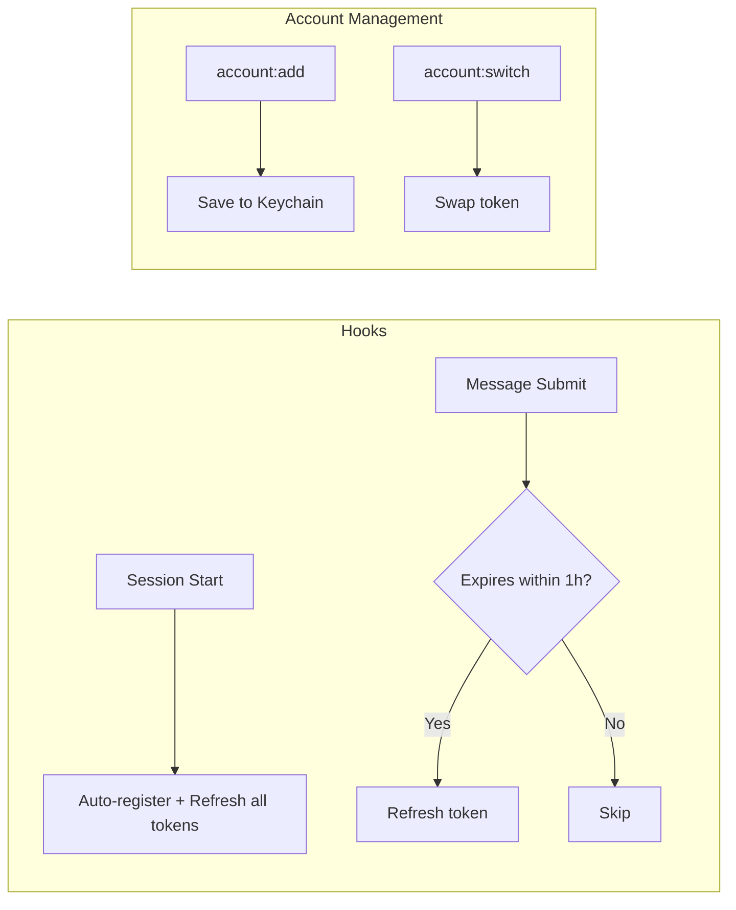

# Claude Code Multi-Account Manager

[한국어](README.ko.md)

A Claude Code plugin for managing multiple accounts. Switch between accounts without logging out and monitor usage at a glance.

## Installation

```bash
# Register marketplace (once)
claude plugin marketplace add https://github.com/lee-ji-hoon/claude-multi-account-manager.git

# Install plugin
claude plugin install account@lee-ji-hoon

# Restart Claude Code
```

After installation, your current account is automatically registered on session start, and terminal aliases (`account`, `account-list`, `account-switch`) are set up.

## Features

- **Account Switching** — Switch to saved accounts instantly without logging out
- **Auto Token Refresh** — Refreshes all tokens on session start; refreshes expiring tokens on each message
- **Usage Monitoring** — Current session (5h) / weekly (7d) usage with progress bars
- **Auto Plan Detection** — Free / Pro / Team / Max5 / Max20
- **Organization Support** — Manages personal and org accounts separately, even with the same email

## Commands

| Command | Description |
|---------|-------------|
| `/account:list` | List accounts + real-time usage |
| `/account:add [name]` | Save current account |
| `/account:switch [id]` | Switch account |
| `/account:remove [id]` | Delete account |
| `/account:check` | Check token status |
| `/account:set-plan [id] [plan]` | Set Plan manually |
| `/account:export` | Export account as JSON |
| `/account:import [json]` | Import accounts from another machine |
| `/account:logs` | View token refresh logs |
| `/account:repair` | Diagnose & fix installation issues |
| `/account:report` | Auto-create GitHub Issue with diagnostics |

## Example

```
/account:list

  Claude Accounts
  ───────────────────────────────────────────────────────
  [1] ● work @Team [Max5] - active
      work@company.com
      now  ██░░░░░░░░░░ 24% | ⏱ 4h 27m
      week ██████░░░░░░ 51% | ⏱ 87h 27m
      token 🔑 6h 15m remaining

  [2]   personal [Pro]
      me@gmail.com
      week ███░░░░░░░░░ 30% | ⏱ 120h 10m
      token 🔑 3h 42m remaining
  ───────────────────────────────────────────────────────
```

## How It Works



### Data Storage

| Item | Location |
|------|----------|
| Account index | `~/.claude/accounts/index.json` |
| OAuth tokens | macOS Keychain + `~/.claude/accounts/credential_*.json` |
| Profiles | `~/.claude/accounts/profile_*.json` |
| Refresh logs | `~/.claude/accounts/logs/token-refresh.log` |

## Terminal Usage

After installation, you can use it directly from the terminal:

```bash
account              # Help
account list         # List accounts
account switch       # Interactive switch
account-list         # Shortcut alias
account-switch       # Shortcut alias
```

## Multi-Mac Sync (Optional)

Sync account data across multiple Macs via Telegram Bot.

```bash
# On Mac A
/account:push          # Send to Telegram

# On Mac B
/account:pull          # Receive from Telegram
```

Setup: Add `bot_token` and `chat_id` to `~/.claude/hooks/telegram-config.json`.

## Troubleshooting

### `/account:repair` — Auto Diagnostics

Automatically diagnoses and fixes installation issues, token errors, and duplicate accounts.

### `/account:report` — Bug Report

If the issue persists, run `/account:report` to collect diagnostics and auto-create a GitHub Issue.

### Manual Checks

```bash
# Token status
/account:check

# Refresh logs
/account:logs

# Log file directly
cat ~/.claude/accounts/logs/token-refresh.log
```

## Requirements

- macOS (uses Keychain)
- Python 3.8+
- Claude Code CLI

## Contributing

Report bugs or suggest features via [Issues](https://github.com/lee-ji-hoon/claude-multi-account-manager/issues).
Run `/account:report` in a Claude Code session to auto-create an Issue with diagnostic info.

## License

MIT
