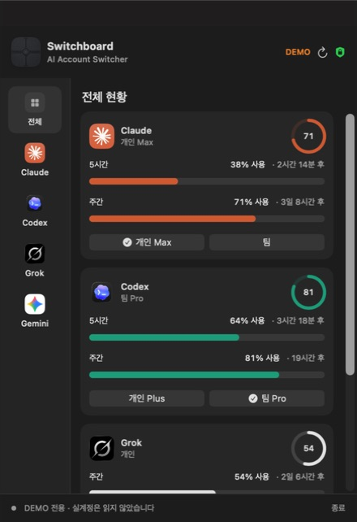
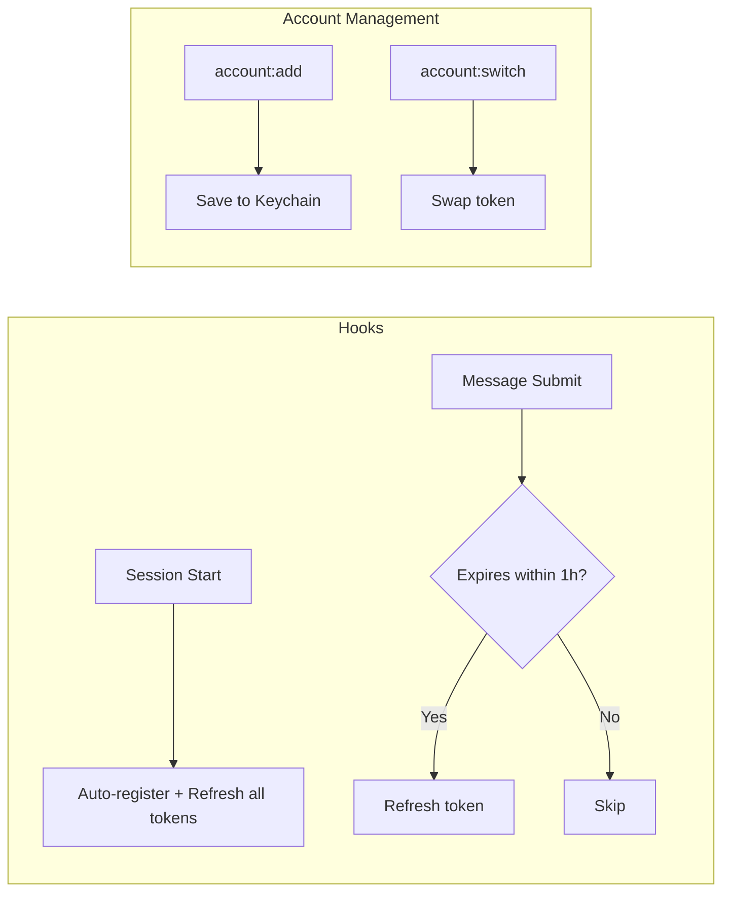

# Switchboard — AI Account Switcher

[한국어](README.ko.md)

One place to monitor and switch accounts for AI coding CLIs. The current CLI plugin supports Claude Code and Codex; the native macOS menu-bar prototype reads live usage from Claude, Codex, Grok, and Gemini through Antigravity (`agy`).

## macOS menu-bar app



The app reads Claude/Codex usage APIs, Grok's local `/usage`, and Antigravity's
read-only `/usage` and `/credits` JSON. It distinguishes `LIVE` from supporting
`DEMO` rows, shows usage/reset times and provider-reported credits, and recommends
an account from the remaining quota.

| Provider | Status | App action |
|---|---|---|
| Claude | 5-hour/weekly usage, reset, token health | Switch saved account and verify profile, Keychain, and account-ID readback |
| Codex | 5-hour/weekly usage, reset, reset/extra credits | Switch saved account and verify the `auth.json` account ID |
| Grok | Weekly usage and reset | Keep existing sessions intact and launch a new session with the selected `GROK_HOME` profile |
| Antigravity (`agy`) | Gemini model quota and credits | Show CLI re-authentication guidance because no official account-switch command is available |

Grok's web-only usage-reset count and expiry have no stable local API, so the
app does not guess them. It links to the web Usage page and never applies a reset,
purchases credits, or enables auto top-up.

### App installation

Extract `Switchboard-macos.zip` from a GitHub Release and place
`Switchboard.app` in `~/Applications`, or build and install it locally:

```bash
git clone https://github.com/lee-ji-hoon/ai-account-switcher.git
cd ai-account-switcher
prototype/switchboard-menubar/install.sh
open "$HOME/Applications/Switchboard.app"
```

LIVE reads and switching require Python 3.8 or later (Homebrew Python or the
`python3` supplied with Xcode Command Line Tools). Local builds also require
Xcode Command Line Tools and macOS 14 or later. The release app is ad-hoc signed; if macOS blocks it, Control-click the app in Finder and
choose **Open**, or use the local-build path above.

For multiple Grok accounts, authenticate each official `GROK_HOME` profile once;
do not copy credential files:

```bash
mkdir -p "$HOME/.grok-profiles/personal"
GROK_HOME="$HOME/.grok-profiles/personal" grok login --oauth

mkdir -p "$HOME/.grok-profiles/work"
GROK_HOME="$HOME/.grok-profiles/work" grok login --oauth
```

Switchboard lists only authenticated `~/.grok` and `~/.grok-profiles/*` homes
and never copies or swaps their `auth.json` files.

## Claude plugin installation

```bash
# Register marketplace (once)
claude plugin marketplace add https://github.com/lee-ji-hoon/ai-account-switcher.git

# Install plugin
claude plugin install account@lee-ji-hoon

# Restart Claude Code
```

After installation, your current account is automatically registered on session start, and terminal aliases (`account`, `account-list`, `account-switch`) are set up.

## Features

- **Account Switching** — Switch to saved accounts instantly without logging out
- **Auto Token Refresh** — Refreshes all tokens on session start; refreshes expiring tokens on each message
- **Usage Monitoring** — Current session (5h) / weekly (7d) usage with progress bars
- **Auto Plan Detection** — Free / Pro / Team / Max5 / Max20
- **Organization Support** — Manages personal and org accounts separately, even with the same email

## Commands

| Command | Description |
|---------|-------------|
| `/account:list` | List accounts + real-time usage |
| `/account:add [name]` | Save current account |
| `/account:switch [id]` | Switch account |
| `/account:remove [id]` | Delete account |
| `/account:check` | Check token status |
| `/account:set-plan [id] [plan]` | Set Plan manually |
| `/account:export` | Export account as JSON |
| `/account:import [json]` | Import accounts from another machine |
| `/account:logs` | View token refresh logs |
| `/account:repair` | Diagnose & fix installation issues |
| `/account:report` | Auto-create GitHub Issue with diagnostics |

## Example

```
/account:list

  Claude Accounts
  ───────────────────────────────────────────────────────
  [1] ● work @Team [Max5] - active
      work@company.com
      now  ██░░░░░░░░░░ 24% | ⏱ 4h 27m
      week ██████░░░░░░ 51% | ⏱ 87h 27m
      token 🔑 6h 15m remaining

  [2]   personal [Pro]
      me@gmail.com
      week ███░░░░░░░░░ 30% | ⏱ 120h 10m
      token 🔑 3h 42m remaining
  ───────────────────────────────────────────────────────
```

## How It Works


```mermaid
flowchart LR
    subgraph Hooks
        A[Session Start] --> B[Auto-register + Refresh all tokens]
        C[Message Submit] --> D{Expires within 1h?}
        D -->|Yes| E[Refresh token]
        D -->|No| F[Skip]
    end

    subgraph Account Management
        G["account:add"] --> H[Save to Keychain]
        I["account:switch"] --> J[Swap token]
    end
```

### Data Storage

| Item | Location |
|------|----------|
| Account index | `~/.claude/accounts/index.json` |
| OAuth tokens | macOS Keychain + `~/.claude/accounts/credential_*.json` |
| Profiles | `~/.claude/accounts/profile_*.json` |
| Refresh logs | `~/.claude/accounts/logs/token-refresh.log` |

## Terminal Usage

After installation, you can use it directly from the terminal:

```bash
account              # Help
account list         # List accounts
account switch       # Interactive switch
account-list         # Shortcut alias
account-switch       # Shortcut alias
```

## Multi-Mac Sync (Optional)

Sync account data across multiple Macs via Telegram Bot.

```bash
# On Mac A
/account:push          # Send to Telegram

# On Mac B
/account:pull          # Receive from Telegram
```

Setup: Add `bot_token` and `chat_id` to `~/.claude/hooks/telegram-config.json`.

## Troubleshooting

### `/account:repair` — Auto Diagnostics

Automatically diagnoses and fixes installation issues, token errors, and duplicate accounts.

### `/account:report` — Bug Report

If the issue persists, run `/account:report` to collect diagnostics and auto-create a GitHub Issue.

### Manual Checks

```bash
# Token status
/account:check

# Refresh logs
/account:logs

# Log file directly
cat ~/.claude/accounts/logs/token-refresh.log
```

## Requirements

- macOS (uses Keychain)
- Python 3.8+
- Claude Code CLI

## Contributing

Report bugs or suggest features via [Issues](https://github.com/lee-ji-hoon/ai-account-switcher/issues).
Run `/account:report` in a Claude Code session to auto-create an Issue with diagnostic info.

## License

MIT
