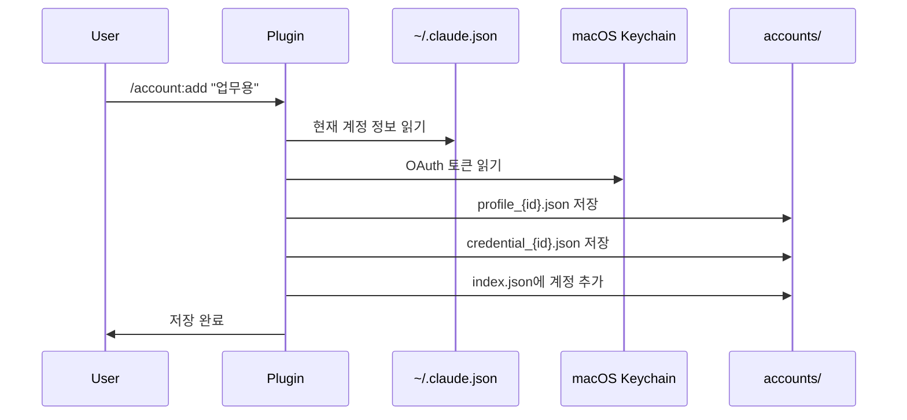
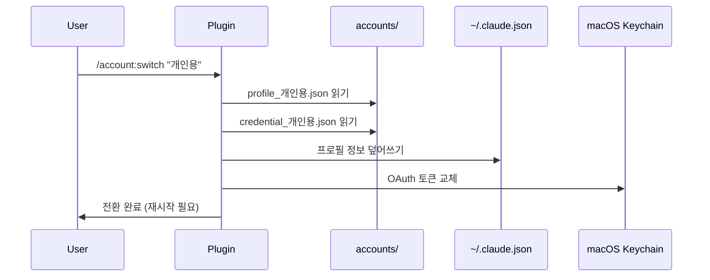
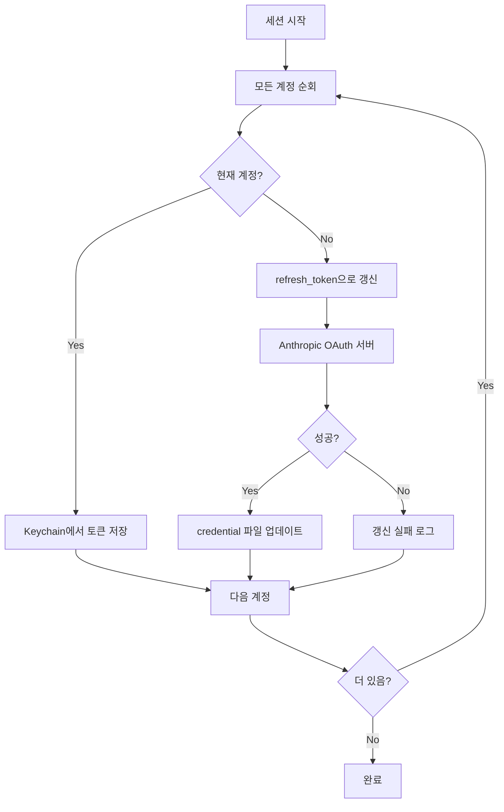
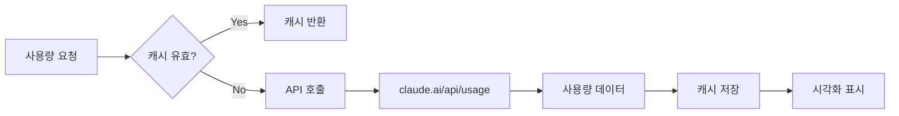

# Architecture & Implementation

Claude Code Multi-Account Manager의 구현 원리와 동작 방식을 설명합니다.

## 데이터 저장 구조

```
~/.claude/                          # Claude Code 기본 디렉토리
├── .claude.json                    # 현재 활성 계정 정보
├── accounts/                       # 다중 계정 데이터
│   ├── index.json                  # 계정 목록 (메타데이터)
│   ├── profile_{id}.json           # 계정별 프로필
│   └── credential_{id}.json        # 계정별 OAuth credential
└── plugins/
    └── claude-hud/
        └── .usage-cache.json       # 사용량 캐시 (HUD 플러그인)

macOS Keychain                      # OAuth 토큰 보안 저장소
└── claude.ai (internet password)   # access_token, refresh_token
```

## 핵심 동작 원리

### 1. 계정 저장 (add)

현재 로그인된 계정 정보를 별도로 복사하여 저장합니다.



**저장되는 데이터:**

```
┌─────────────────────────────────────────────────────────┐
│  ~/.claude.json (원본)                                   │
│  ┌───────────────────────────────────────────────────┐  │
│  │ oauthAccount: { email, displayName, ... }         │  │
│  │ accountUuid: "abc-123"                            │  │
│  └───────────────────────────────────────────────────┘  │
└─────────────────────────────────────────────────────────┘
                          │
                          ▼ 복사
┌─────────────────────────────────────────────────────────┐
│  accounts/profile_업무용.json                            │
│  ┌───────────────────────────────────────────────────┐  │
│  │ oauthAccount: { email, displayName, ... }         │  │
│  │ accountUuid: "abc-123"                            │  │
│  └───────────────────────────────────────────────────┘  │
└─────────────────────────────────────────────────────────┘

┌─────────────────────────────────────────────────────────┐
│  macOS Keychain (원본)                                   │
│  ┌───────────────────────────────────────────────────┐  │
│  │ accessToken: "eyJ..."                             │  │
│  │ refreshToken: "refresh_..."                       │  │
│  │ expiresAt: 1234567890                             │  │
│  └───────────────────────────────────────────────────┘  │
└─────────────────────────────────────────────────────────┘
                          │
                          ▼ 복사
┌─────────────────────────────────────────────────────────┐
│  accounts/credential_업무용.json                         │
│  ┌───────────────────────────────────────────────────┐  │
│  │ accessToken: "eyJ..."                             │  │
│  │ refreshToken: "refresh_..."                       │  │
│  │ expiresAt: 1234567890                             │  │
│  └───────────────────────────────────────────────────┘  │
└─────────────────────────────────────────────────────────┘
```

### 2. 계정 전환 (switch)

저장된 계정 정보를 Claude Code 활성 계정으로 복원합니다.



**전환 과정:**

```
┌──────────────────┐     ┌──────────────────┐
│   저장된 계정     │     │   활성 계정       │
│   (accounts/)    │     │ (.claude.json)   │
└────────┬─────────┘     └────────┬─────────┘
         │                        │
         │    1. 프로필 복원       │
         │───────────────────────▶│
         │                        │
         │    2. Keychain 교체     │
         │───────────────────────▶│ (macOS Keychain)
         │                        │
         │    3. 재시작 필요       │
         │                        │
         ▼                        ▼
┌──────────────────────────────────────────────┐
│  Claude Code 재시작 후 새 계정으로 동작       │
└──────────────────────────────────────────────┘
```

### 3. 토큰 자동 갱신

**세션 시작 시 모든 계정의 토큰을 무조건 갱신**합니다.

이 방식의 장점:
- 장기간 미사용 계정의 토큰 만료 방지
- 세션 중간에 토큰이 만료되는 상황 방지
- A 계정 사용 중에도 B 계정 토큰이 항상 최신 유지



**핵심 방어 로직:**

```
┌─────────────────────────────────────────────────────────┐
│  세션 시작 (SessionStart Hook)                           │
└─────────────────────────────────────────────────────────┘
                          │
                          ▼
┌─────────────────────────────────────────────────────────┐
│  refresh-all 실행                                        │
│  ├─ 계정 A (현재): Keychain → credential 파일 저장       │
│  ├─ 계정 B: refresh_token → 새 access_token 발급        │
│  └─ 계정 C: refresh_token → 새 access_token 발급        │
└─────────────────────────────────────────────────────────┘
                          │
                          ▼
┌─────────────────────────────────────────────────────────┐
│  결과: 모든 계정이 최신 토큰 보유                          │
│  - 만료 여부와 관계없이 무조건 갱신                        │
│  - 오랫동안 안 쓴 계정도 토큰 유효                         │
└─────────────────────────────────────────────────────────┘
```

**갱신 API 호출:**

```
POST https://platform.claude.com/v1/oauth/token
Content-Type: application/x-www-form-urlencoded

grant_type=refresh_token
&refresh_token={refresh_token}
&client_id=9d1c250a-e61b-44d9-88ed-5944d1962f5e

Response:
{
  "token_type": "Bearer",
  "access_token": "sk-ant-oat01-...(새 토큰)",
  "refresh_token": "sk-ant-ort01-...(새 갱신 토큰)",
  "expires_in": 28800,
  "scope": "user:inference user:mcp_servers user:profile user:sessions:claude_code"
}
```

**중요:** refresh_token은 일회용입니다. 갱신 시 새 refresh_token이 발급되고 기존 토큰은 무효화됩니다.

### 4. 사용량 조회

Claude.ai API에서 실시간 사용량을 조회합니다.



**API 응답 데이터:**

```json
{
  "daily": {
    "standard": { "limit": 100, "remaining": 72, "resetsAt": "..." },
    "premium": { "limit": 50, "remaining": 35, "resetsAt": "..." }
  },
  "weekly": {
    "standard": { "limit": 500, "remaining": 280, "resetsAt": "..." },
    "premium": { "limit": 250, "remaining": 100, "resetsAt": "..." }
  }
}
```

## 세션 시작 Hook

플러그인 설치 시 SessionStart Hook이 자동으로 등록됩니다.

```
┌─────────────────────────────────────────────────────────┐
│  Claude Code 시작                                        │
└─────────────────────────────────────────────────────────┘
                          │
                          ▼
┌─────────────────────────────────────────────────────────┐
│  SessionStart Hook 실행                                  │
│  └─ hooks-handlers/session-start.sh                     │
└─────────────────────────────────────────────────────────┘
                          │
                          ▼
┌─────────────────────────────────────────────────────────┐
│  account_manager.py auto-add                            │
│  ├─ 현재 계정이 등록되어 있는가?                          │
│  │   └─ No → 자동 등록                                   │
│  └─ 모든 저장된 계정 토큰 갱신                            │
└─────────────────────────────────────────────────────────┘
                          │
                          ▼
┌─────────────────────────────────────────────────────────┐
│  출력 예시:                                              │
│  [auto-add] 새 계정 등록: 코니 [Max5]                    │
│  [refresh] 업무용: 토큰 갱신됨 [Max5]                     │
│  갱신 완료: 2개 계정                                      │
└─────────────────────────────────────────────────────────┘
```

## 보안 고려사항

### OAuth 토큰 저장

| 데이터 | 저장 위치 | 보안 수준 |
|--------|----------|----------|
| access_token | macOS Keychain | 높음 (시스템 암호화) |
| refresh_token | macOS Keychain | 높음 (시스템 암호화) |
| credential 백업 | accounts/credential_*.json | 중간 (파일 권한) |
| 프로필 정보 | accounts/profile_*.json | 낮음 (공개 정보) |

### Keychain 접근

```bash
# 토큰 읽기
security find-internet-password -s "claude.ai" -w

# 토큰 쓰기
security add-internet-password -s "claude.ai" -a "default" -w "{token_json}"
```

## Plan 감지 로직

```
┌─────────────────────────────────────────────────────────┐
│  credential.json 분석                                    │
└─────────────────────────────────────────────────────────┘
                          │
                          ▼
┌─────────────────────────────────────────────────────────┐
│  organizationSettings 확인                               │
│  ├─ claudeProExpiry 존재? → Pro                         │
│  ├─ maxApiProjectLimit = 20? → Max20                    │
│  ├─ maxApiProjectLimit = 5? → Max5                      │
│  └─ canUseClaudeTeam? → Team                            │
└─────────────────────────────────────────────────────────┘
                          │
                          ▼
┌─────────────────────────────────────────────────────────┐
│  membershipPlan 확인                                     │
│  ├─ "max" → Max5                                        │
│  ├─ "pro" → Pro                                         │
│  └─ 없음 → Free                                         │
└─────────────────────────────────────────────────────────┘
```

## 사용량 시각화

```
  Claude 계정 목록
  ───────────────────────────────────────────────────────
  [1] → 업무용 [Max5] - 현재
      work@company.com
      현재 ███░░░░░░░░░ 28% | ⏱ 3h 41m    ← 현재 세션 사용량
      주간 ███████░░░░░ 60% | ⏱ 69h 41m   ← 주간 누적 사용량
  ───────────────────────────────────────────────────────

  Progress Bar 계산:
  ┌────────────────────────────────────────┐
  │ 사용량 % = (limit - remaining) / limit │
  │ 바 길이 = 12칸                          │
  │ 채워진 칸 = round(% * 12)               │
  └────────────────────────────────────────┘
```

## 파일 포맷

### index.json

```json
{
  "accounts": [
    {
      "id": "work",
      "name": "업무용",
      "email": "work@company.com",
      "plan": "Max5",
      "is_current": true,
      "created_at": "2024-01-15T09:00:00Z",
      "last_used": "2024-01-20T14:30:00Z"
    },
    {
      "id": "personal",
      "name": "개인용",
      "email": "me@gmail.com",
      "plan": "Pro",
      "is_current": false,
      "created_at": "2024-01-10T10:00:00Z",
      "last_used": "2024-01-18T20:00:00Z"
    }
  ]
}
```

### credential_{id}.json

```json
{
  "accessToken": "eyJhbGciOiJSUzI1NiIsInR5cCI6IkpXVCJ9...",
  "refreshToken": "refresh_abc123...",
  "expiresAt": 1705766400,
  "claudeAiSessionKey": "sk-ant-sid01-..."
}
```

### profile_{id}.json

```json
{
  "oauthAccount": {
    "email": "work@company.com",
    "displayName": "Work Account",
    "uuid": "abc-123-def-456"
  },
  "accountUuid": "abc-123-def-456"
}
```
